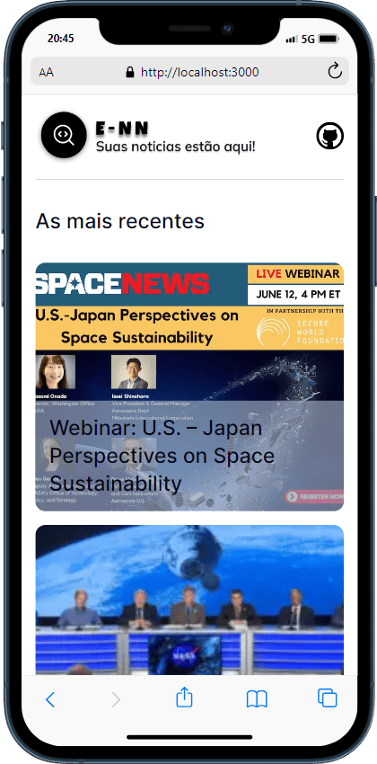
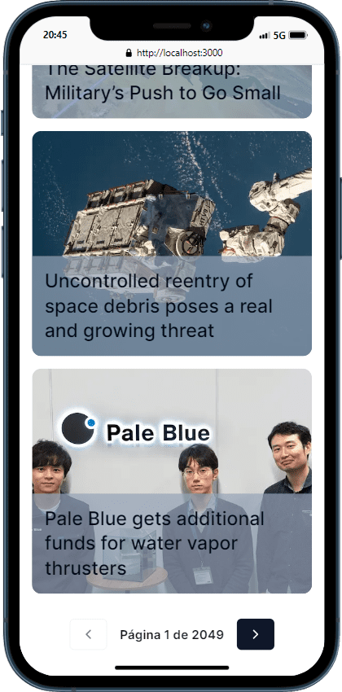

# Desafio técnico Tech pro bem |


> Projeto desenvolvido para Tech pro bem. Aplicação é uma pagina de noticias desenvolvida em NextJs-14, nela é possivel visualizar as noticas mais
>recentes no munda cientifico espacial. O conteudo é fornecido pela api Spaceflight News desenvolvida por  The Space Devs (TSD).

> Utilizado técnicas de roteamento do proprio nextjs-14, os estados da aplicação está sendo gerenciado pelo React query, assim foi possivel alcançar uma melhor perfomance da Api em relação a paginação fornecida pela Api.

## 100% Responsive

<div
  style="width:100%; display:flex; gap:16px, flex-wrap: wrap"
>



</div>


## Implantações do projeto

- [x] - Título da notícia.
- [x] - Fragmento da notícia.
- [x] - Uma imagem ilustrativa da notícia.
- [x] - Autor.
- [x] - Data da Publicação
- [x] - Responsivo.
- [x] - Consumo Api externa
- [x] - Configurar rotas da api
- [x] - Organização de pastas

## 💻 Como usar o projeto

<h3>Clone o repositorio</h3>

```bash
git clone https://github.com/Du-devBR/tech-pro-bem.git
```

```bash
cd tech-pro-bem/
```


```bash
npm install
```

### Frontend
```bash
npm run dev
```

```bash
http://localhost:3000/
```

### 🛠 Tecnologias

As seguintes ferramentas foram usadas na construção do projeto:

- [NextJs](https://nextjs.org/)
- [Tailwindcss](https://tailwindcss.com/)
- [TypeScript](https://www.typescriptlang.org/)
- [TanStack - React query](https://tanstack.com/query/latest)
- [Shadcnui](https://ui.shadcn.com/docs)
